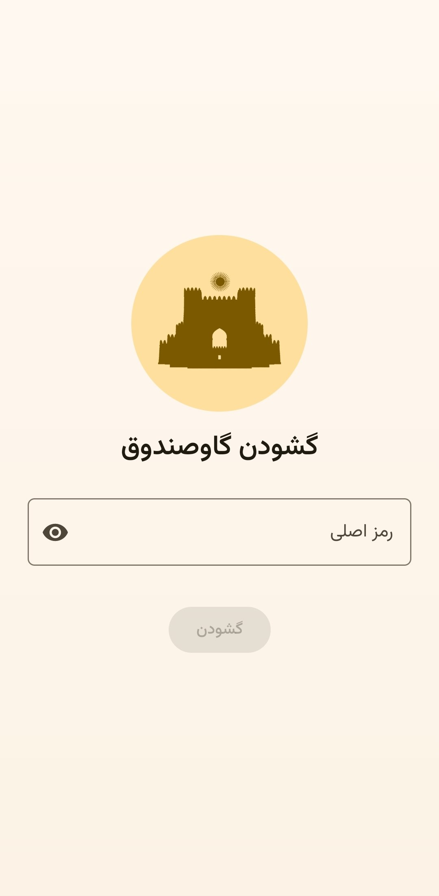
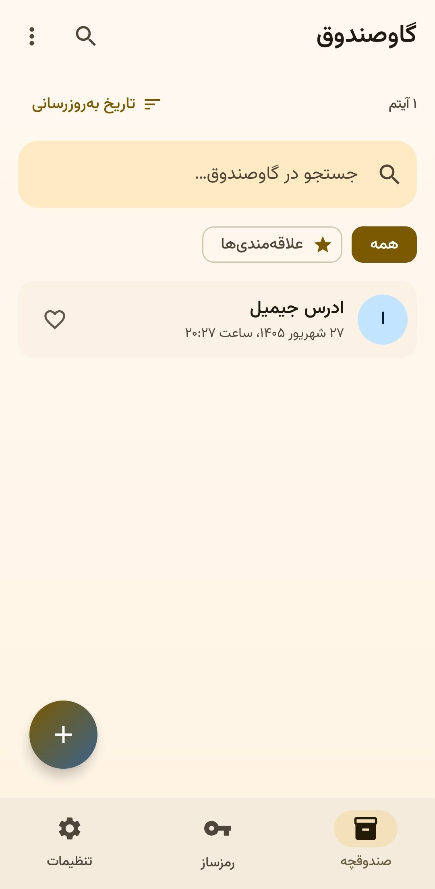
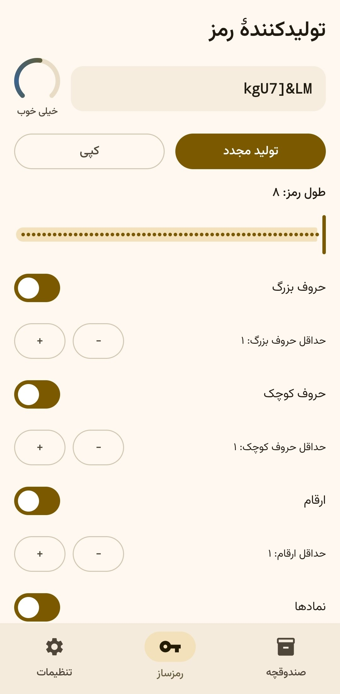
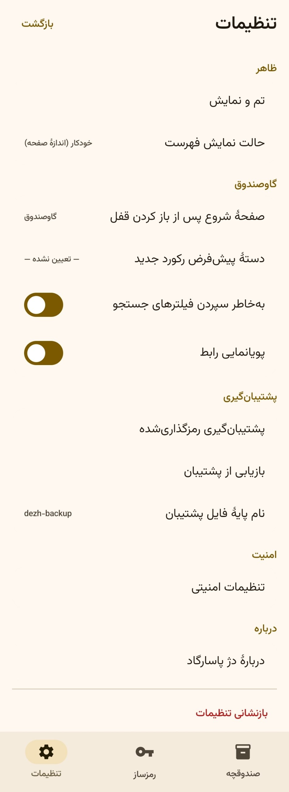
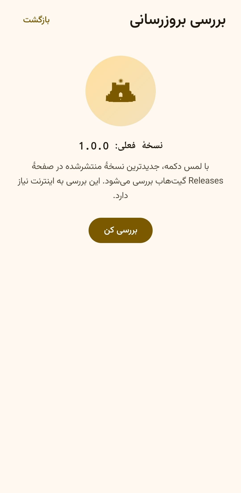

<div dir="rtl" align="center">

# دژ پاسارگاد | Dezh-e Pasargad


**گاوصندوق رمز عبور آفلاین، فارسی‌محور و متن‌باز برای اندروید**
رمزنگاری واقعی روی دستگاه · بدون تبلیغ · بدون ردیابی · بدون ابر · بدون حساب کاربری

[](LICENSE)
[](https://github.com/Kourosh242/dezh-pasargad/releases/tag/1.0.0)
[](#سازگاری)
[](https://kotlinlang.org)
[](https://developer.android.com/compose)
[](#حریم-خصوصی-و-مجوزها)

</div>

---

<div dir="rtl">

## دژ پاسارگاد چیست؟

دژ پاسارگاد یک مدیر رمز عبور **آفلاین** برای اندروید است که تمام اسرار شما را با رمزنگاری استاندارد (AES-256-GCM) و کلیدی که تنها از رمز اصلی شما مشتق می‌شود (PBKDF2-HMAC-SHA256) روی خود دستگاه نگه می‌دارد. هیچ سروری وجود ندارد، هیچ داده‌ای جایی ارسال نمی‌شود و کلید نشست هرگز روی دیسک نوشته نمی‌شود. رابط کاربری کاملاً فارسی و راست‌به‌چپ، با تقویم جلالی و فونت وزیرمتن طراحی شده است.

> نام اپ از «دژ» (پناهگاه محافظ) و «پاسارگاد» (میرات تاریخی ایران) گرفته شده است: گاوصندوقی استوار برای اسرار شما.

## نمایش برنامه

| گشودن گاوصندوق | صندوقچه | رمزساز |
|:---:|:---:|:---:|
|  |  |  |

| تنظیمات | بررسی بروزرسانی |
|:---:|:---:|
|  |  |

## ویژگی‌ها

### 🔐 امنیت
- **رمزنگاری چندلایه:** رمز اصلی → PBKDF2-HMAC-SHA256 (۶۰۰٬۰۰۰ تکرار، هم‌راستا با OWASP) → بازگشایی کلید دادهٔ تصادفی (DEK) → AES-256-GCM برای هر رکورد.
- **کلید فقط در حافظه:** کلید نشست تنها در RAM نگه داشته می‌شود و هنگام قفل‌شدن کامل صفر می‌گردد (سیاست fail-closed).
- **Android Keystore:** پارامترهای امنیتی و شمارندهٔ تلاش‌ها در فایل متادیتای رمزنگاری‌شده با کلید غیرخروجی Keystore نگهداری می‌شوند تا دستکاری پارامترهای KDF ممکن نباشد.
- **محدودسازی تلاش نادرست:** تأخیر نمایی پس از هر ورود ناموفق (تا ۱۵ ثانیه) با شمارندهٔ مقاوم به دستکاری.
- **قفل خودکار هوشمند:** بلافاصله / ۱ / ۵ / ۱۵ / ۳۰ دقیقه؛ بدون گزینهٔ «هرگز»؛ قفل خودکار هنگام خروج از اپ و خاموش‌شدن صفحه.
- **حفاظت از عکاسی:** مسدودسازی پیش‌نمایش و اسکرین‌شات در صفحه‌های حساس (FLAG_SECURE)، با قابلیت خاموش‌کردن توسط کاربر.
- **پاک‌سازی خودکار کلیپ‌بورد:** هر رمز کپی‌شده پس از مهلت قابل تنظیم از کلیپ‌بورد پاک می‌شود.
- **بدون متن خام در دیتابیس:** تنها payload رمزنگاری‌شده ذخیره می‌شود؛ جستجو پس از گشودن و در حافظه انجام می‌شود.

### 🗄️ گاوصندوق
- رکوردها با عنوان، نام کاربری، ایمیل، رمز عبور، یادداشت، دسته‌بندی و علاقه‌مندی.
- جستجوی زنده (رمزگشایی در حافظه)، فیلتر دسته و علاقه‌مندی‌ها، مرتب‌سازی، شمارش آیتم‌ها.
- تاریخ‌های شمسی (تقویم جلالی) برای ساخت و ویرایش هر رکورد.

### 💾 پشتیبان‌گیری و بازیابی
- خروجی/ورودی **رمزنگاری‌شده** از طریق SAF با قالب نسخه‌دار (envelope + AAD + checksum).
- تشخیص دقیق «رمز اشتباه» از «فایل خراب».
- بازیابی مرحله‌ای با پیش‌نمایش تغییرات و حالت‌های ادغام/جایگزینی؛ هرگز بدون تأیید صریح شما چیزی بازنویسی نمی‌شود.

### 🎲 تولیدکنندهٔ رمز
- تولید با `SecureRandom` و قیدهای طول، کلاس نویسه‌ها و حداقل هر کلاس.
- سنجهٔ قدرت entropy-محور (هم‌راستا با NIST SP 800-63B) با حلقهٔ بصری زنده.
- کپی امن با پاک‌سازی خودکار کلیپ‌بورد.

### 🎨 تجربهٔ کاربری
- رابط کاملاً فارسی و RTL + زبان انگلیسی؛ فونت وزیرمتن (OFL).
- تم روشن / تیره / پیرو سیستم، ۵ رنگ اکسنت، مقیاس فونت قابل تنظیم.
- ناوبری پایین سه‌بخشی (صندوقچه، رمزساز، تنظیمات)، حرکات نرم با احترام به reduced-motion، اهداف لمسی استاندارد و لیبل‌های دسترس‌پذیری فارسی.

### 🔄 بروزرسانی شفاف
- بررسی دستی نسخهٔ جدید از طریق GitHub Releases و **نصب درون‌اپی** با `PackageInstaller` رسمی اندروید و پنجرهٔ تأیید خود سیستم.
- اعتبارسنجی پیش از نصب: بسته، versionCode و امضای APK؛ محدودسازی هاست دانلود، سقف حجم و بازاعتبارسنجی هر گام ریدایرکت در کانال مجاز.
- بدون هیچ تعاملی با Google Play؛ بدون نصب بی‌صدا.

## حریم خصوصی و مجوزها

اپ به‌صورت پیش‌فرض **کاملاً آفلاین** است؛ بدون تبلیغ، بدون تحلیل رفتار (Analytics)، بدون ردیاب و بدون هیچ سرویس شخص ثالث. تنها دو مجوز درخواست می‌شود:

| مجوز | کاربرد |
|---|---|
| `INTERNET` | فقط و فقط «بررسی بروزرسانی» (خواندن آخرین Release از GitHub) |
| `REQUEST_INSTALL_PACKAGES` | فعال‌کردن جریان رسمی «نصب برنامه‌های ناشناس» خود اندروید برای نصب درون‌اپی |

علاوه بر این: `allowBackup=false` و قوانین `dataExtractionRules` طوری تنظیم شده‌اند که دادهٔ گاوصندوق هرگز در پشتیبان‌گیری یا انتقال سیستمی کپی نشود.

## سازگاری

| مورد | وضعیت |
|---|---|
| حداقل اندروید | اندروید ۱۰ (API 29) |
| پشتیبانی کامل | اندروید ۱۰ تا اندروید ۱۶ (و جدیدتر) — targetSdk/compileSdk 37 |
| معماری CPU | **یونیورسال**: بدون کد بومی (Native)؛ سازگار با همهٔ معماری‌ها (arm64-v8a، armeabi-v7a، x86_64، x86) |
| دستگاه‌ها | گوشی و تبلت؛ سازگار با صفحه‌نمایش‌های مختلف (واکنش‌گرا بر پایهٔ WindowSizeClass) |
| زبان‌ها | فارسی (پیش‌فرض، RTL) و انگلیسی |
| خروجی | یک APK یونیورسال بهینه‌شده با R8 (حدود ۳٫۷ مگابایت) |

## دریافت و نصب

1. به صفحهٔ [Releases](https://github.com/Kourosh242/dezh-pasargad/releases) بروید و آخرین نسخه را باز کنید.
2. فایل `dezh-pasargad-release.apk` را دانلود کنید.
3. روی دستگاه، اجازهٔ «نصب برنامه‌های ناشناس» برای مرورگر/فایل‌منجر خود را بدهید و نصب کنید.

> ⚠️ **هشدار امنیتی:** APK را فقط از صفحهٔ Releases رسمی همین مخزن دانلود کنید. اپ پیش از نصب هر بروزرسانی، امضای دیجیتال آن را با امضای نسخهٔ نصب‌شده تطبیق می‌دهد؛ در صورت عدم تطابق، نصب متوقف می‌شود.

## پشتیبان‌گیری توصیه‌شده

از مسیر «تنظیمات ← پشتیبان‌گیری رمزگذاری‌شده» یک فایل پشتیبان بسازید و آن را در محل امن نگه دارید. فایل پشتیبان خودش رمزنگاری‌شده است، اما عبارت عبور پشتیبان را جدا از دستگاه نگه دارید؛ **رمز اصلی شما قابل بازیابی نیست** و هیچ مسیر «فراموشی رمز» وجود ندارد.

## ساخت از سورس

پیش‌نیازها: JDK 17، Android SDK (پلتفرم `android-37.0` و build-tools 36.0.0).

```bash
# سورس پروژه داخل این پوشه است؛ ابتدا وارد آن شوید
cd dezh-passwordmanager-1.0.0

# راه‌اندازی محیط (اختیاری؛ برای ماشین تازه)
scripts/setup-dev-env.sh
source env.sh && echo "sdk.dir=$ANDROID_HOME" > local.properties

# تست‌های واحد و UI (Robolectric)
./gradlew :app:testDebugUnitTest

# گیت‌های کیفیت
./gradlew :app:detekt
./gradlew :app:lintDebug

# بیلد انتشار (unsigned)
./gradlew :app:assembleRelease
```

خروجی release بدون امضا تولید می‌شود؛ امضا با keystoreٔ شخصی **خارج از این مخزن** انجام می‌گیرد و فایل keystore هرگز نباید به مخزن افزوده شود.

## ساختار پروژه

```
app/src/main/java/com/pasargad/dezh/
├── navigation/      ناوبری تک‌اکتیویتی (Navigation 3) و سیاست صفحهٔ امن
├── presentation/    صفحه‌ها و ViewModelها (Compose + StateFlow)
├── domain/          UseCaseها، مدل‌ها، سنجهٔ قدرت رمز، تقویم جلالی، سیاست بروزرسانی
├── data/            Room (رمزنگاری در لایهٔ داده)، DataStore، درگاه فایل پشتیبان، لایهٔ بروزرسانی
├── security/        نشست کلید (RAM)، مخزن امنیتی، Keystore، قفل خودکار، سیاست تلاش ورود
├── cryptography/    AES-GCM، PBKDF2، wrap کلید، قالب‌های نسخه‌دار DPKW/DPVG
├── backup/          کدک پشتیبان رمزنگاری‌شده، برنامه‌ریز بازیابی، مدیر پشتیبان
├── generator/       تولیدکنندهٔ رمز (SecureRandom)
├── settings/        تنظیمات پایدار (Preferences DataStore) و کنترل تم
├── di/              تزریق وابستگی دستی (AppContainer)
└── ui/              تم برند، حرکات و کامپوننت‌های مشترک
```

معماری: تک‌ماژول و لایه‌بندی‌شده به سبک MVVM — `presentation → domain → data/security/cryptography`؛ بدون XML UI، بدون Fragment و بدون کتابخانهٔ DI سنگین.

## تست و کیفیت

- **۲۵۹ تست** در ۴۵ کلاس تست واحد/Robolectric (رمزنگاری، قالب‌های فایل، مهاجرت دیتابیس، سیاست‌های امنیتی، جریان پشتیبان/بازیابی، تست‌های UI Compose) + تست دستگاه در `androidTest`.
- تست دودِ سرتاسری (end-to-end) که کل سفر کاربر را روی پشتهٔ واقعی رمزنگاری اجرا می‌کند.
- گیت‌های کیفیت: `detekt` با پیکربندی سخت‌گیرانه (صفر یافته) و `lint` سبز در هر تغییر.
- قالب‌های دیتابیس Room نسخه‌بندی و commit شده‌اند تا مهاجرت‌ها تست‌پذیر بمانند.

## مجوزها

- کد این پروژه تحت پروانهٔ [MIT](LICENSE) — Copyright (c) 2026 Kourosh242.
- فونت **وزیرمتن** تحت پروانهٔ SIL Open Font License 1.1 — مشاهدهٔ متن پروانه: [`licenses/OFL-Vazirmatn.txt`](dezh-passwordmanager-1.0.0/licenses/OFL-Vazirmatn.txt).
- کتابخانه‌های AndroidX، Jetpack Compose و Kotlin تحت پروانهٔ Apache-2.0 هستند.

## سلب مسئولیت

هیچ نرم‌افزاری «صددرصد امن» نیست. دژ پاسارگاد از رمزنگاری استاندارد، اصل حداقل دسترسی و سیاست fail-closed استفاده می‌کند و پشتیبان‌ها را رمزنگاری‌شده نگه می‌دارد، اما مسئولیت نگه‌داری رمز اصلی و فایل‌های پشتیبان بر عهدهٔ کاربر است.

## مشارکت و گزارش مشکل

پیشنهادهای بهبود و گزارش اشکال از طریق [Issues](https://github.com/Kourosh242/dezh-pasargad/issues) خوش‌آمد است. برای تغییرات امنیتی، لطفاً پیش از انتشار عمومی، ابتدا به‌صورت خصوصی اطلاع دهید.

---

<samp>ساخته‌شده با ❤️ برای جامعهٔ فارسی‌زبان — Copyright (c) 2026 Kourosh242، پروانهٔ MIT.</samp>

</div>
